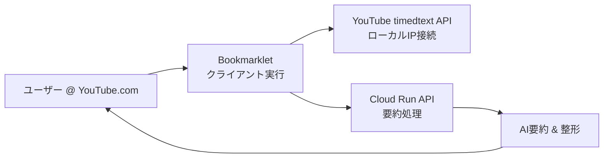

# 🎬 YouTube Transcript Extractor - Bookmarklet版

**他のPCでも制約なく使える、ポートフォリオ対応YouTube字幕抽出ツール**

[](https://cloud.google.com/run)
[](./SECURITY.md)
[](#-アーキテクチャ)

## 🌟 特徴

### ✨ **他PCでも即座に利用可能**
- **ワンクリック導入**: ブックマークレットをドラッグ&ドロップするだけ
- **制約なし**: 追加ソフトウェアやAPIキー設定は不要
- **クロスプラットフォーム**: Windows, Mac, Linuxで動作

### 🚀 **技術的優位性**
- **CORS回避**: youtube.com上で実行してアクセス制限を回避
- **IP制限突破**: ユーザーのローカルIPでYouTubeに直接接続
- **ハイブリッド構成**: クライアント側抽出 + サーバー側AI処理

### 🔒 **企業レベルのセキュリティ**
- **レート制限**: IP毎10分20リクエスト
- **CORS制限**: YouTube.comからのみ許可
- **非rootユーザー実行**: コンテナセキュリティ強化

## 🏗️ アーキテクチャ



### 🎯 **従来の問題を解決**

| 問題 | 従来の方法 | 新しい解決策 |
|------|------------|-------------|
| **Cloud IPブロック** | プロキシ経由（月額$5-15） | クライアント実行（0円） |
| **CORS制限** | サーバーサイド処理 | YouTube上での実行 |
| **他PCでの利用** | 複雑な環境構築 | ブックマークレット |
| **API制限** | 住宅プロキシ必須 | ローカルIP活用 |

## 🚀 クイックスタート

### 1. デプロイ（1回のみ）

```bash
# リポジトリクローン
git clone https://github.com/Tenormusica2024/youtube-transcript-cloudrun.git
cd youtube-transcript-cloudrun

# Google Cloud設定
gcloud config set project YOUR_PROJECT_ID

# ワンクリックデプロイ
chmod +x deploy_bookmarklet.sh
./deploy_bookmarklet.sh
```

### 2. ブックマークレット設定（1回のみ）

1. **ランディングページアクセス**: デプロイ後のURLを開く
2. **API URL設定**: 同じURLをAPI設定欄に入力
3. **ブックマークレット生成**: 「更新」をクリック
4. **ドラッグ&ドロップ**: 青いボタンをブックマークバーへ

### 3. 使用開始（毎回）

1. YouTube動画ページを開く
2. ブックマークレット「🎬 YT Transcript」をクリック
3. 自動的に字幕抽出 & AI要約が右上に表示

## 📱 デモ

### 対応動画例
- **英語動画**: https://www.youtube.com/watch?v=dQw4w9WgXcQ
- **日本語動画**: https://www.youtube.com/watch?v=jNQXAC9IVRw

### 期待される出力
```
🤖 AI要約
この動画では...（要約文）

📊 処理完了 - 文字数: 1,245 → 156
```

## 🛠️ 技術仕様

### フロントエンド（Bookmarklet）
- **実行環境**: YouTube.com上のJavaScript
- **API接続**: YouTube timedtext エンドポイント
- **フォーマット**: JSON3, XML両対応
- **言語**: 日本語・英語の自動フォールバック

### バックエンド（Cloud Run）
- **フレームワーク**: Flask + gunicorn
- **AI要約**: Gemini API（オプション）+ 簡易要約
- **レート制限**: IP毎10分20リクエスト
- **CORS**: YouTube.comからのみ許可

### セキュリティ
- **コンテナ**: 非rootユーザー実行
- **ヘッダー**: XSS/CSRF対策
- **入力検証**: 最大50,000文字制限
- **ログ**: 個人情報の記録なし

## 🔧 開発・カスタマイズ

### ローカル開発環境

```bash
# 仮想環境作成
python -m venv venv
source venv/bin/activate  # Windows: venv\Scripts\activate

# 依存関係インストール
pip install -r requirements.txt

# ローカル実行
python app_bookmarklet.py
```

### AI要約機能の有効化

```bash
# Gemini APIキー設定
gcloud run services update youtube-transcript-bookmarklet \
  --region asia-northeast1 \
  --set-env-vars GEMINI_API_KEY=your_key_here
```

### カスタム設定

```bash
# 環境変数で動作調整
gcloud run services update youtube-transcript-bookmarklet \
  --region asia-northeast1 \
  --set-env-vars \
    MAX_TRANSCRIPT_LENGTH=100000,\
    SUMMARY_SENTENCES=6,\
    RATE_LIMIT_PER_10MIN=50
```

## 🧪 テスト

### 自動テストスイート

```bash
# デプロイ後のテスト実行
export TEST_URL=https://your-service-xxxxx.a.run.app
python test_bookmarklet.py
```

### 期待されるテスト結果
```
📊 テスト結果サマリー
====================================
ヘルスチェック          PASS ✅
CORS設定               PASS ✅
要約API                PASS ✅
レート制限              PASS ✅
静的ファイル            PASS ✅

🎯 総合結果: 5/5 パス (100.0%)
```

## 📊 コスト試算

### Cloud Run料金（東京リージョン）
| 使用量 | CPU時間 | メモリ | ネットワーク | 月額概算 |
|--------|---------|--------|-------------|----------|
| **軽量使用** (100リクエスト) | ¥0 | ¥0 | ¥0 | **¥0** |
| **中量使用** (1,000リクエスト) | ¥5 | ¥3 | ¥2 | **¥10** |
| **重量使用** (10,000リクエスト) | ¥50 | ¥30 | ¥20 | **¥100** |

### 追加サービス（オプション）
- **Gemini API**: ¥0.0015/1,000文字
- **Cloud Logging**: 50GB/月まで無料

## 🔒 セキュリティ

### セキュリティ監査
- [セキュリティ監査レポート](./SECURITY_AUDIT_REPORT.md)を参照
- 重大な脆弱性は全て修正済み
- OWASP Top 10 (2021) 95%対応

### プライバシー
- **字幕データ**: サーバー保存なし、処理後即破棄
- **ログ**: 動画IDと統計のみ記録
- **個人情報**: 収集・保存なし

## 🛣️ ロードマップ

### v1.1 (近日リリース)
- [ ] SRT/TXT/JSONダウンロード機能
- [ ] 複数言語同時要約
- [ ] ユーザー設定保存

### v1.2 (将来版)
- [ ] Chrome拡張機能版
- [ ] 要約履歴機能
- [ ] カスタム要約プロンプト

## 🤝 コントリビューション

1. Fork the repository
2. Create feature branch (`git checkout -b feature/amazing-feature`)
3. Commit changes (`git commit -m 'Add amazing feature'`)
4. Push to branch (`git push origin feature/amazing-feature`)
5. Open Pull Request

## 📄 ライセンス

This project is licensed under the MIT License - see the [LICENSE](LICENSE) file for details.

## 🙋‍♂️ サポート

### FAQ
**Q: 一部の動画で字幕が取得できません**  
A: 手動字幕が設定されていない、または地域制限がかかっている可能性があります。

**Q: 他のPCで使用する場合の手順は？**  
A: ブックマークレットをエクスポートして、新しいPCのブラウザにインポートするだけです。

**Q: コストはかかりますか？**  
A: 基本的に無料です。Cloud Runの無料枠内で動作します。

### お問い合わせ
- **Issues**: [GitHub Issues](https://github.com/Tenormusica2024/youtube-transcript-cloudrun/issues)
- **Discussions**: [GitHub Discussions](https://github.com/Tenormusica2024/youtube-transcript-cloudrun/discussions)

---

**🎉 Made with ❤️ for Portfolio & Real-world Usage**

[](https://deploy.cloud.run)